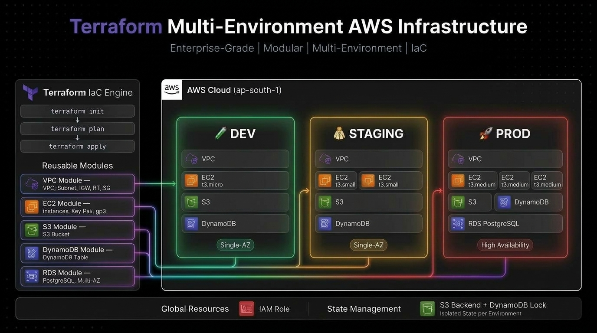

# 🚀 Enterprise Multi-Environment AWS Infrastructure with Terraform & GitHub Actions

[](https://www.terraform.io/)
[](https://aws.amazon.com/)
[](https://github.com/features/actions)
[](LICENSE)

An enterprise-grade, modular, multi-environment infrastructure repository provisioned on **Amazon Web Services (AWS)** using **Terraform** and automated via **GitHub Actions CI/CD pipelines**.

---

##  Architecture Overview

This project uses an **Environment-Isolated Directory Structure** combined with **Reusable Local Modules** to follow dry principles, limit blast radius, and enforce state isolation between environments.



### 📊 Environment Specifications

| Environment | VPC CIDR | Subnet CIDR | EC2 Count | EC2 Type | Storage | RDS Database | High Availability |
| :--- | :--- | :--- | :--- | :--- | :--- | :--- | :--- |
| 🧪 **Dev** | `10.0.0.0/16` | `10.0.1.0/24` | 1 | `t3.micro` | 10 GB gp3 | ❌ No | Single-AZ |
| 🥼 **Staging** | `10.1.0.0/16` | `10.1.1.0/24` | 2 | `t3.small` | 10 GB gp3 | ❌ No | Single-AZ |
| 🚀 **Prod** | `10.2.0.0/16` | `10.2.1.0/24` | 3 | `t3.medium` | 30 GB gp3 | ✅ PostgreSQL | Multi-AZ |

---

## 📂 Repository Directory Structure

```text
Terra-Project/
│
├── 📁 .github/
│   └── 📁 workflows/
│       ├── 📄 terraform-validate.yml  # PR Check: Code format, syntax & validation
│       ├── 📄 terraform-deploy.yml    # Main Branch: Auto-apply to target environment
│       └── 📄 terraform-destroy.yml   # Manual Workflow: Safe teardown with confirmation
│
├── 📁 modules/                        # Reusable Infrastructure Modules (DRY)
│   ├── 📁 vpc/                        # Custom VPC, Subnets, IGW, Route Tables & SG
│   ├── 📁 ec2/                        # EC2 Instances, Key Pair & Root Storage
│   ├── 📁 rds/                        # AWS RDS Database & Subnet Group
│   ├── 📁 s3/                         # S3 Storage Bucket with unique naming
│   └── 📁 dynamodb/                   # DynamoDB Table (PAY_PER_REQUEST)
│
├── 📁 environments/                   # Isolated Environment Configurations
│   ├── 📁 global/                     # Shared account resources (IAM Roles, Route53)
│   ├── 📁 dev/                        # Development Environment
│   ├── 📁 staging/                    # Staging Environment
│   └── 📁 prod/                       # Production Environment (with RDS)
│
├── 📁 Images/                         # Architecture Diagrams & Screenshots          
├── 📄 .gitignore                      # Terraform & Security ignore rules
└── 📄 README.md                       # Project Documentation
```

---

## 🛠️ Prerequisites

Before you start, ensure you have the following installed and configured:
- [Terraform CLI](https://developer.hashicorp.com/terraform/downloads) `>= 1.0.0`
- [AWS CLI](https://aws.amazon.com/cli/) `>= 2.0` configured with valid credentials (`aws configure`)
- Git for version control

---

## Local Quick Start

### 1️⃣ Clone the Repository
```bash
git clone https://github.com/your-username/Terraform-Multi-Env-AWS.git
cd Terraform-Multi-Env-AWS
```

### 2️⃣ Generate SSH Key Pair
Generate a local SSH key pair for EC2 authentication:
```bash
ssh-keygen -t rsa -b 4096 -f Terra_Key -N '""'
```

### 3️⃣ Deploy an Environment (e.g. `dev`)
```bash
# Navigate to the target environment
cd environments/dev

# Initialize modules and provider plugins
terraform init

# Review planned infrastructure changes
terraform plan

# Apply changes to provision resources in AWS
terraform apply
```

### 4️⃣ Teardown / Destroy Infrastructure
```bash
terraform destroy
```

---

## ?? Outputs

After a successful `terraform apply`, Terraform will automatically display key infrastructure values in your terminal, including:

| Output Key | Description |
| :--- | :--- |
| `ec2_public_ips` | Public IP addresses of all provisioned EC2 instances |
| `s3_bucket_id` | Unique ID of the environment-specific S3 bucket |
| `vpc_id` | ID of the created VPC |
| `subnet_id` | ID of the provisioned public subnet |

You can retrieve these values at any time (without re-applying) by running:

```bash
terraform output
```

To fetch a specific value:

```bash
terraform output ec2_public_ips
terraform output s3_bucket_id
```

> **Note:** Sensitive outputs such as the RDS database password (prod only) are marked as `sensitive = true` and will not be displayed in plain text. Use `terraform output -json` to inspect them programmatically if needed.

---

## CI/CD Automation (GitHub Actions)

This repository includes **3 automated production-grade GitHub Actions workflows**:

### 1. Validation Pipeline (`terraform-validate.yml`)
- **Triggers**: Pull Requests targeting `main` / `master`.
- **Actions**: Enforces code formatting (`terraform fmt -check`), initializes modules, and runs `terraform validate` across all environments.

### 2. Deployment Pipeline (`terraform-deploy.yml`)
- **Triggers**: Code merges to `main` branch or manual dispatch.
- **Actions**: Runs `terraform apply -auto-approve` on target environment.

### 3. Safe Destroy Pipeline (`terraform-destroy.yml`)
- **Triggers**: Manual dispatch via Actions tab.
- **Safety Gate**: Requires selecting the target environment and typing exact text **`DESTROY`** in the confirmation input to prevent accidental teardowns.

### 🔑 Setting up GitHub Repository Secrets
To enable GitHub Actions, go to **Repository Settings** ➡️ **Secrets and variables** ➡️ **Actions** and add:
- `AWS_ACCESS_KEY_ID`
- `AWS_SECRET_ACCESS_KEY`

---

## 🔒 Security & Best Practices

- **Zero Hardcoded Secrets**: Secrets and passwords use sensitive variables and AWS Secrets Manager integration.
- **Git-Ignored Credentials**: Private SSH keys (`Terra_Key`, `*.pem`, `*.key`) and local state files (`*.tfstate`) are strictly ignored via [`.gitignore`](file:///c:/Users/dell/OneDrive/Desktop/project/Terra-Project/.gitignore).
- **State Isolation**: Every environment maintains an independent state file to minimize blast radius.

---
